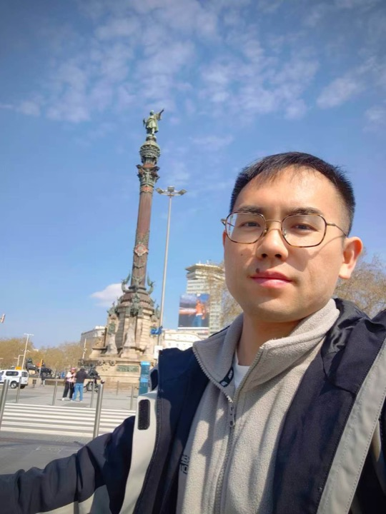

# Hi, I am Cohen

I am a postdoctoral researcher working in condensed matter physics, ARPES, and computational materials research.

My current interests include electronic structure, spectroscopic signatures of quantum materials, first-principles calculations, and AI-assisted workflows for literature reading, research planning, and scientific writing.

## Research Interests

- Condensed matter physics
- ARPES data analysis and interpretation
- Computational materials science and first-principles calculations
- Electronic structure, electron-phonon coupling, and emergent phases
- Chiral phonons and related lattice dynamics
- AI-assisted literature learning, research planning, and manuscript development

## Current Focus

- Building a personal knowledge system for condensed matter literature
- Organizing paper-reading workflows with DeepTutor, Codex, and custom research skills
- Developing practical workflows for turning literature understanding into research ideas
- Exploring research problems that connect ARPES, materials computation, and physical interpretation

## Selected Repositories

- [condensed-matter-paper-reading](https://github.com/KeyuAN95/condensed-matter-paper-reading): structured notes and workflows for reading condensed matter papers
- [arpes-analysis-skill](https://github.com/KeyuAN95/arpes-analysis-skill): AI-assisted workflow support for ARPES analysis
- [Arpes_ANA](https://github.com/KeyuAN95/Arpes_ANA): ARPES analysis scripts and research notes
- [Plot-by-python](https://github.com/KeyuAN95/Plot-by-python): Python examples for scientific plotting and figure preparation

## Tools

Python, Jupyter, GitHub, ARPES analysis, DFT workflows, DeepTutor, Codex, and AI-assisted research systems.

## Research Style

I am interested in workflows that connect careful literature reading, physical intuition, reproducible computation, and clear scientific storytelling.
